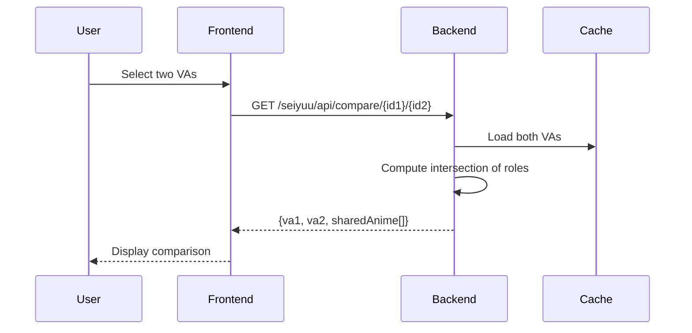
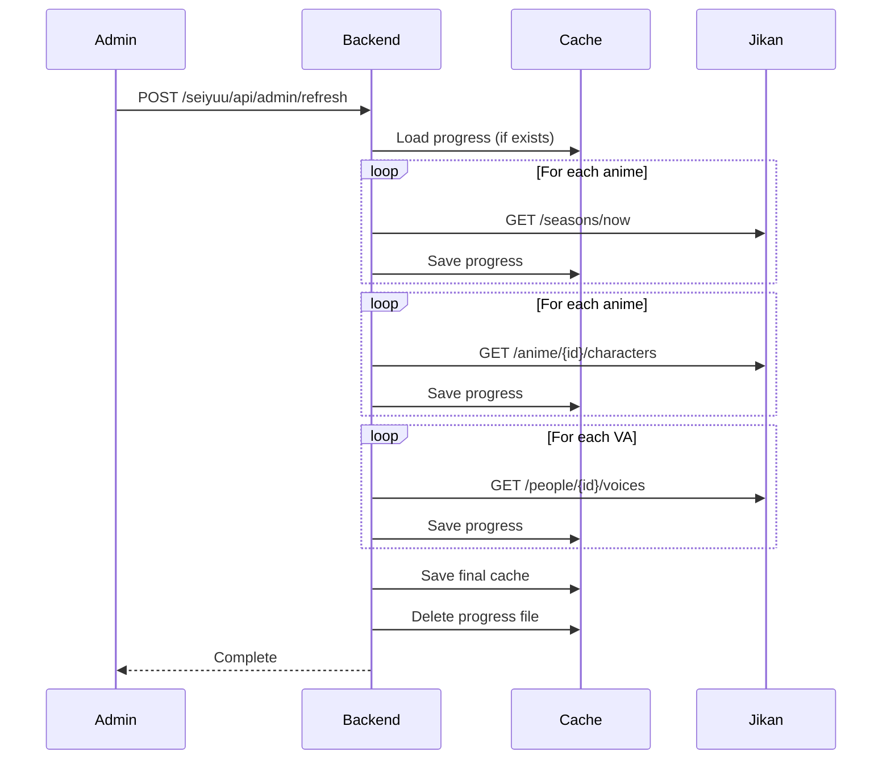

# Seasonal Seiyuu - Architecture

## System Overview

```
┌─────────────────────────────────────────────────────────────┐
│                         Browser                              │
│  ┌─────────────────────────────────────────────────────────┐│
│  │  Frontend (Vanilla JS SPA)                              ││
│  │  - Landing page with VA grid                            ││
│  │  - Detail page with tabs                                ││
│  │  - Hash-based routing                                   ││
│  └─────────────────────────────────────────────────────────┘│
└─────────────────────────────────────────────────────────────┘
                              │
                              ▼
┌─────────────────────────────────────────────────────────────┐
│                   Spring Boot Backend                        │
│  ┌─────────────────┐  ┌──────────────┐  ┌────────────────┐ │
│  │ Controllers     │  │ Services     │  │ Models         │ │
│  │ - VoiceActor    │  │ - JikanApi   │  │ - VoiceActor   │ │
│  │ - Admin         │  │ - Cache      │  │ - Anime        │ │
│  │                 │  │ - SeasonData │  │ - Character    │ │
│  └─────────────────┘  └──────────────┘  └────────────────┘ │
│                              │                              │
│  ┌───────────────────────────┴───────────────────────────┐ │
│  │                    File System                         │ │
│  │  data/season-cache.json    data/refresh-progress.json │ │
│  └───────────────────────────────────────────────────────┘ │
└─────────────────────────────────────────────────────────────┘
                              │
                              ▼
┌─────────────────────────────────────────────────────────────┐
│                      Jikan API v4                           │
│                  (MyAnimeList data)                         │
└─────────────────────────────────────────────────────────────┘
```

## Component Responsibilities

### JikanApiService
- HTTP client for Jikan API
- Rate limiting (fixed 1s delay and retry with backoff for 429s)
- **Robust Fetching**: `fetchWithRetry` ensures data completeness for characters and roles

### CacheService
- JSON file persistence using Jackson
- In-memory caching of `SeasonCache` to avoid repeated disk reads
- Load/save refresh progress for resumability

### SeasonDataService
- Orchestrates data fetching workflow
- Aggregates VAs across all anime
- **Data Validation**: Checks anime counts against API totals and tracks zero-character results
- Manages resumable refresh state

### Performance Optimization
- **Lightweight Summaries**: The main list endpoint `/api/voice-actors` returns `VoiceActorSummary` objects (ID, name, image, show counts) rather than the full `VoiceActor` DTO which contains potentially thousands of career roles.
- **Frontend Lazy Loading**: Role grids and large lists are rendered as needed.

### VoiceActorController
- Public REST endpoints
- Returns cached data only (no live API calls)
- Compare endpoint: finds shared anime between two VAs

### CompareService
- Computes comparison stats between two VAs
- Finds intersection of allTimeRoles by anime ID
- Returns shared anime with both characters

### AdminController
- Protected by API key filter
- Triggers refresh operations
- Reports refresh progress

## Data Flow: Compare Operation



## Data Flow: Refresh Operation


