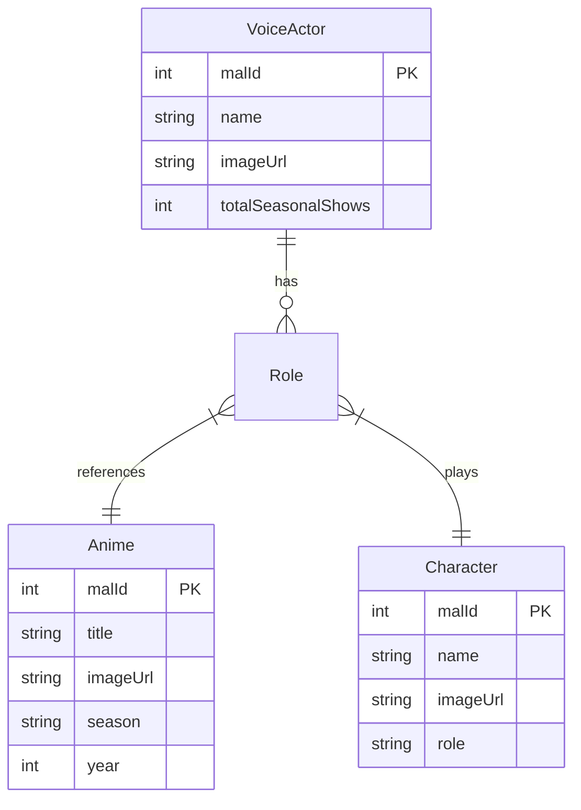

# Seasonal Seiyuu - Feature Specification

## Overview
A web application that aggregates voice actor information for the current anime season, allowing users to discover which shows their favorite VAs are in and explore their career history.

## User Stories

### Landing Page
**As a** visitor  
**I want to** see a grid of all voice actors in the current season  
**So that** I can quickly find who is active and how many shows they're in

**Acceptance Criteria:**
- VA cards show profile image, name, and show count
- Sorted by number of shows (most active first)
- Search filter by VA name
- Responsive grid layout
- **Sticky Search**: Search bar stays fixed at the top while scrolling

### Voice Actor Detail Page
**As a** visitor  
**I want to** click a VA and see their current season roles  
**So that** I can discover which shows they're in

**Acceptance Criteria:**
- Header with VA image and name
- Tab 1: Current season roles with anime + character info
- Tab 2: All-time career roles (full history)
- Back navigation to list

### Admin Refresh
**As an** admin  
**I want to** trigger a data refresh for the new season  
**So that** the site stays current each quarter

**Acceptance Criteria:**
- POST endpoint with API key authentication
- Progress tracking during long refresh
- Resumable if interrupted
- Status endpoint to monitor progress

### Compare Voice Actors
**As a** visitor  
**I want to** compare two voice actors side-by-side  
**So that** I can see their shared anime and compare their careers

**Acceptance Criteria:**
- **Searchable Autocomplete**: Select two VAs using a hybrid searchable input with image previews
- Side-by-side stats comparison (total roles, seasonal shows)
- Aggregated list of shared anime with all characters they played in each
- **External Links**: Direct MyAnimeList (MAL) links for voice actors, anime titles, and characters
- Shareable URL (e.g., `#/compare/123/456`)
- Works with any VA in the current season's dataset

```

### About Page
**As a** visitor  
**I want to** learn about the project and its creation  
**So that** I understand the tech stack and the AI-driven development process

**Acceptance Criteria:**
- Accessible via "About" link in header
- Describes project purpose and features
- Mentions Use of **Antigravity AI**
- Lists tech stack (Java 25, Spring Boot, etc.)
- Link to GitHub repository
┌─────────────────────────────────────────────────────┐
│  [VA 1 Dropdown ▼]    ⚔️    [VA 2 Dropdown ▼]      │
├───────────────────────┬─────────────────────────────┤
│  [Image]              │                    [Image]  │
│  Sugita Tomokazu      │          Nakamura Yuuichi   │
│  523 career roles     │            487 career roles │
│  8 shows this season  │        6 shows this season  │
├───────────────────────┴─────────────────────────────┤
│             🤝 12 Shared Anime                      │
│  ┌─────────────────────────────────────────────┐   │
│  │ Gintama                                      │   │
│  │ Gintoki Sakata ←→ Shinsuke Takasugi         │   │
│  └─────────────────────────────────────────────┘   │
│  ┌─────────────────────────────────────────────┐   │
│  │ JoJo's Bizarre Adventure                    │   │
│  │ Joseph Joestar ←→ Jotaro Kujo               │   │
│  └─────────────────────────────────────────────┘   │
└─────────────────────────────────────────────────────┘
```

## Data Model



## API Specification

All endpoints are served under the `/seiyuu` context path.

### Public Endpoints

| Method | Path | Description |
|--------|------|-------------|
| GET | `/seiyuu/api/voice-actors` | List all VAs (sorted by show count) |
| GET | `/seiyuu/api/voice-actors/{id}` | Get VA with seasonal + all-time roles |
| GET | `/seiyuu/api/season-info` | Get current season metadata |
| GET | `/seiyuu/api/compare/{id1}/{id2}` | Compare two VAs (stats + shared anime) |

### Admin Endpoints (X-API-Key required)

| Method | Path | Description |
|--------|------|-------------|
| POST | `/seiyuu/api/admin/refresh` | Trigger data refresh |
| GET | `/seiyuu/api/admin/refresh/status` | Get refresh progress |
